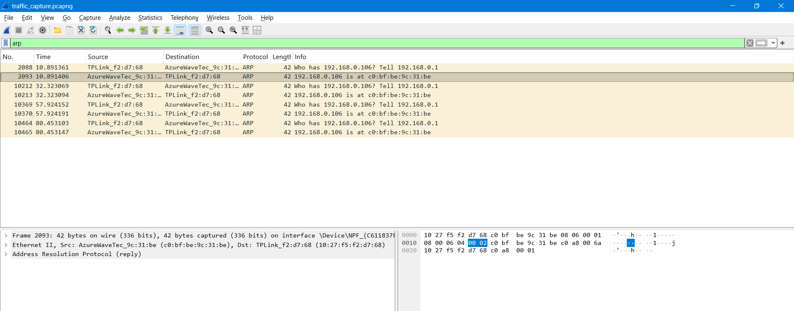
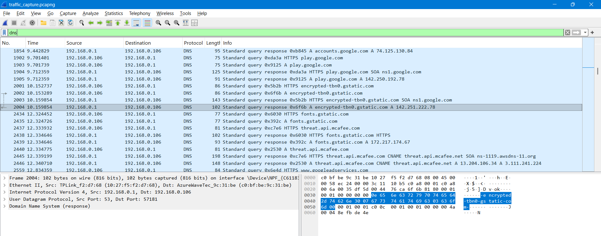
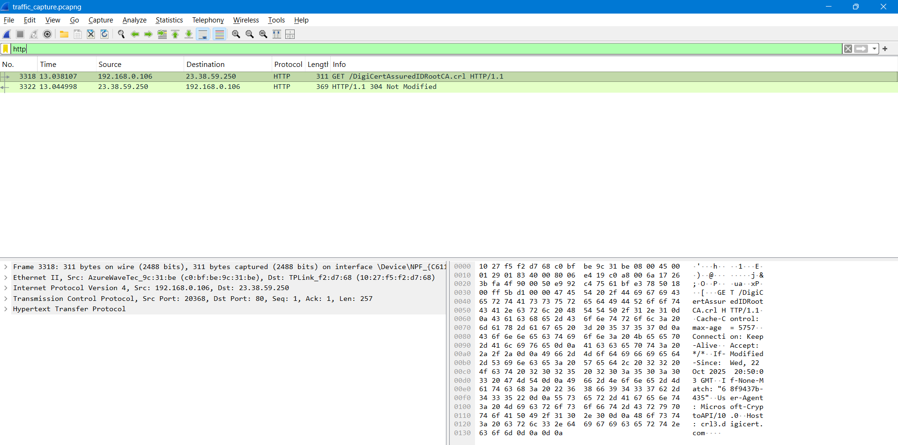
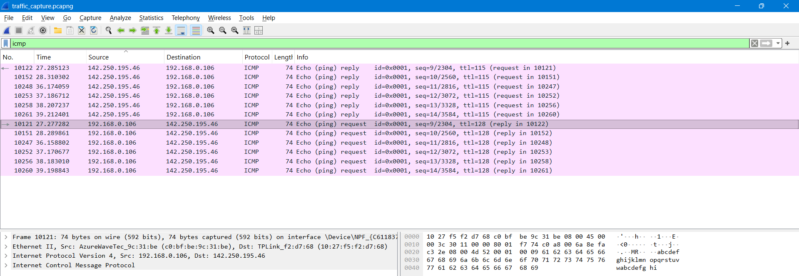
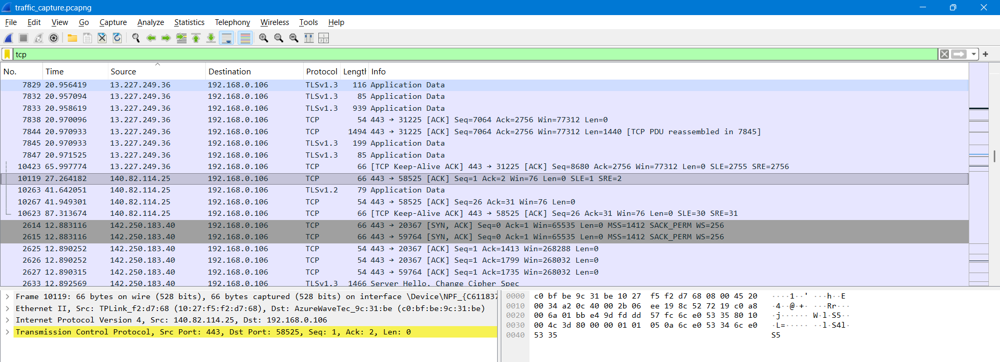

**Wireshark Network Traffic Analysis**

**Task Overview**  
The objective was to **capture live network traffic using Wireshark**, apply protocol-based filters, and analyze packet details to understand how different network protocols operate.

---

**Tools Used**  
- **Wireshark** – For capturing and analyzing live network packets.  
- **Web Browser / Ping Command** – To generate web and ICMP traffic for analysis.

**Steps Performed**  
1. Opened **Wireshark** and selected the active network interface.  
2. Started live packet capture and generated traffic by:  
   - Visiting multiple websites.  
   - Using the `ping` command to create ICMP packets.  
3. Stopped the capture after approximately **2 minutes**.  
4. Applied **display filters** to isolate traffic by specific protocols:  
   - `arp`  
   - `dns`  
   - `http`  
   - `icmp`  
   - `tcp`  
5. Saved the capture as a `.pcap` file and analyzed the packet details.

---

**Protocol Analysis**

**ARP (Address Resolution Protocol)**  
**Filter Used:** `arp`  
**Purpose:** Maps IP addresses to MAC addresses within the local network.  
**Observation:**  
Requests like *“Who has 10.0.2.2? Tell 10.0.2.15”* indicate devices querying MAC addresses of others on the LAN.  
**Screenshot:**  

---

**DNS (Domain Name System)**  
**Filter Used:** `dns`  
**Purpose:** Resolves human-readable domain names (e.g., `google.com`) into IP addresses.  
**Observation:**  
Queries observed for domains such as *google.com*, *youtube.com*, and *mozilla.net*.  
Both IPv4 (`A`) and IPv6 (`AAAA`) responses were detected.  
**Screenshot:**  

---

**HTTP (Hypertext Transfer Protocol)**  
**Filter Used:** `http`  
**Purpose:** Transfers web pages and resources between browsers and servers.  
**Observation:**  
Requests like *GET /success.txt?ipv4* were captured, showing web resource retrievals.  
Responses included status codes such as **200 OK**, indicating successful transfers.  
**Screenshot:**  

---
**ICMP (Internet Control Message Protocol)**  
**Filter Used:** `icmp`  
**Purpose:** Used mainly for diagnostics, such as the **ping** command.  
**Observation:**  
Captured echo requests and replies between the host system and external IPs.  
TTL values and sequence numbers confirmed successful round-trip communication.  
**Screenshot:**  

---

**TCP (Transmission Control Protocol)**  
**Filter Used:** `tcp`  
**Purpose:** Provides reliable, ordered, and error-checked data transmission.  
**Observation:**  
Observed **three-way handshake** sequences (`SYN`, `SYN-ACK`, `ACK`) establishing TCP connections prior to HTTP communication.  
Subsequent packets contained actual application data.  
**Screenshot:**  

---

**How to Open the `.pcap` File**  
1. Download and install **Wireshark** from [https://www.wireshark.org/](https://www.wireshark.org/).  
2. Open the `network_capture.pcap` file to view and analyze captured packets.  
3. Use protocol filters (`arp`, `dns`, `http`, `icmp`, `tcp`) to isolate specific traffic.

---

**Outcome**  
- Successfully **captured and analyzed** multiple real-world network protocols.  
- Learned to use **Wireshark display filters** to focus on particular traffic types.  
- Gained deeper understanding of **ARP, DNS, HTTP, ICMP, and TCP** packet structures and communication patterns.  

