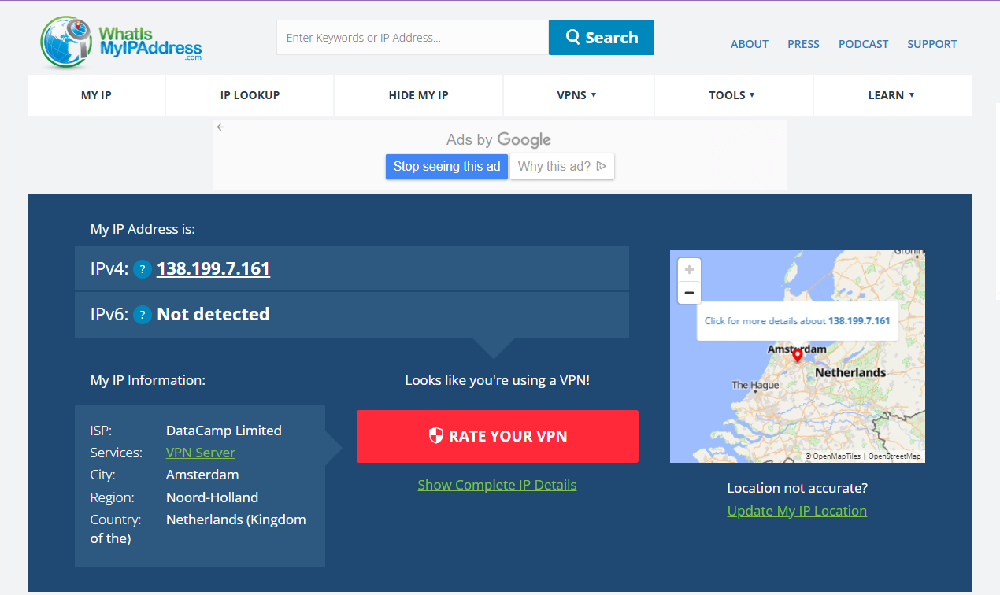

**Task 8 : Working with VPNs**

**Objective:**  
Understand the role of VPNs in protecting privacy and enabling secure communication over the internet.

---

**Tools Used:**  
- **VPN Client:** ProtonVPN (Free Tier)  
- **Verification Tool:** [whatismyipaddress.com](https://whatismyipaddress.com)

---

**Steps Followed:**  

**1. Selected VPN Service**  
Chose **ProtonVPN**, a trusted free VPN known for its strong privacy policies and advanced encryption standards.

**2. Account Setup**  
Created a free ProtonVPN account and verified it via email.

**3. Installation**  
Downloaded and installed the ProtonVPN client for Windows.

**4. Connecting to VPN Server**  
- Launched ProtonVPN and logged in.  
- Used **Quick Connect** to automatically connect to the nearest available server.  
- Successfully connected to a **VPN server located in Amsterdam, Netherlands.**

**5. IP Address Verification**  
Before connecting, my IP reflected my original location (India).  
After connecting, the IP changed as shown below:

**Screenshot 1:**  

**Screenshot 2:**  

**IP Details:**  
- **IPv4:** 138.199.7.161  
- **ISP:** DataCamp Limited  
- **Service:** VPN Server  
- **City:** Amsterdam  
- **Country:** Netherlands  

This confirmed that my VPN connection was active and my traffic was being routed securely through the Netherlands.

**6. Browsing Verification**  
Accessed multiple websites (Google, YouTube, etc.) to ensure that browsing was smooth and encrypted (HTTPS padlock visible).

**7. Disconnect and Compare**  
After disconnecting, my IP reverted to the original Indian IP address.  
Browsing speed increased slightly after disconnecting — a normal effect due to encryption overhead while using VPN.

---

**Research on VPN Encryption & Privacy Features**

**Encryption Protocols:**  
- **OpenVPN:** Secure and reliable; uses AES-256 encryption.  
- **IKEv2/IPSec:** Fast, especially for mobile users.  
- **WireGuard:** Lightweight and faster modern protocol.

**Privacy Features:**  
- **IP Masking:** Hides your real IP and location.  
- **Data Encryption:** Protects your data from hackers and ISPs.  
- **No-Logs Policy:** Ensures the VPN provider doesn’t store your browsing data.  
- **Kill Switch:** Blocks internet access if VPN disconnects to prevent data leaks.

---

**Summary: VPN Benefits and Limitations**

**Benefits:**  
- Hides IP address and protects identity.  
- Encrypts online data to prevent tracking.  
- Secures connections on public Wi-Fi.  
- Bypasses regional content restrictions.  

**Limitations:**  
- Free VPNs may have bandwidth or speed limitations.  
- May slightly reduce browsing speed due to encryption.  
- Some free VPNs may log or sell user data — choose trusted ones.  
- Doesn’t ensure total anonymity (browser fingerprints, cookies, etc. still trackable).

---

**Outcome:**  
Successfully configured and used ProtonVPN, verified encrypted communication, confirmed IP masking, and gained hands-on experience with privacy-enhancing tools.
